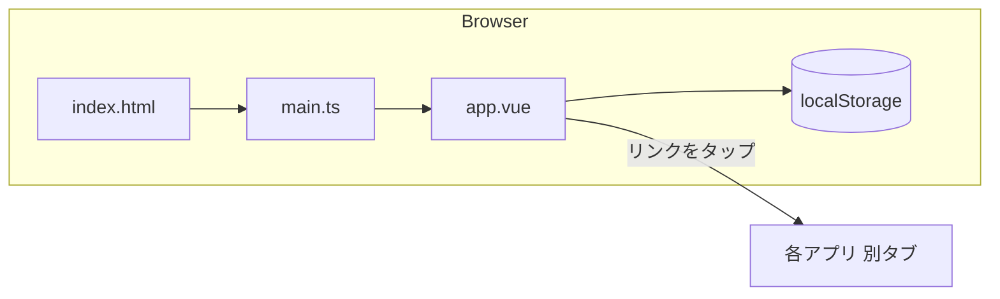
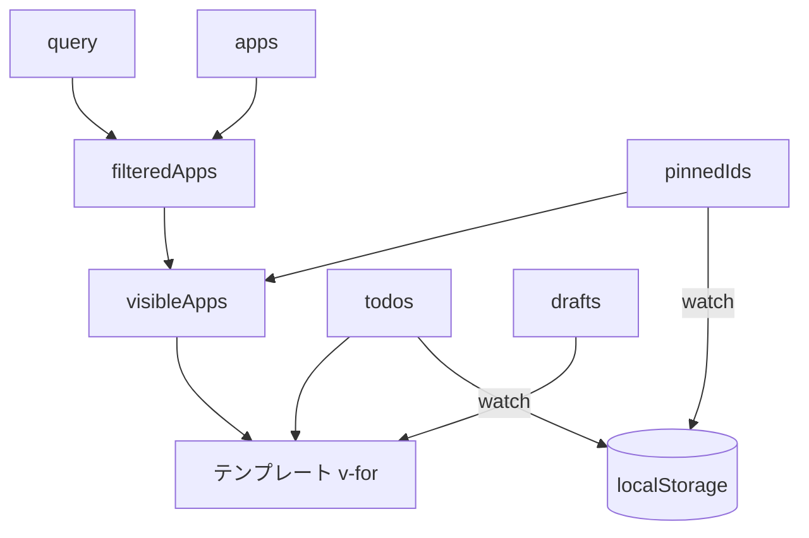

# 設計書 — My iPad Portal

要件は `requirements.md`、画面・挙動の仕様は `specification.md` を参照。本書は「どう作っているか」（構造・データフロー・設計判断）を記す。

## 1. 全体構成

| 層 | 内容 |
|----|------|
| 実行環境 | ブラウザのみ（SPA。サーバー処理なし） |
| UI | Vue 3（Composition API / `<script setup>`）。単一コンポーネント |
| ビルド | Vite + `@vitejs/plugin-vue`。成果物は静的ファイル（`dist/`） |
| 永続化 | localStorage（ピン留め・TODO） |
| 外部連携 | なし（アプリへは `<a target="_blank">` のリンクのみ） |



コンポーネントを分割せず `app.vue` 1ファイルに収めている。理由は、画面が1つで規模が小さく、状態（ピン・TODO・検索語）がすべて同じ一覧に紐づくため。分割するとprops/emitが増えるだけになる。

## 2. ファイル別の責務

| ファイル | 責務 |
|----------|------|
| `index.html` | エントリ。viewport、iOSホーム画面追加用のmeta（`apple-mobile-web-app-*`）、`theme-color` |
| `src/main.ts` | `createApp(App).mount('#app')` と `style.css` の読み込みのみ |
| `src/app.vue` | アプリ一覧データ、状態管理、保存処理、検索・並び替え、テンプレート |
| `src/style.css` | 全スタイル。コンポーネントスコープは使わず、クラス名で管理 |
| `src/env.d.ts` | `.vue` を import するための型宣言 |
| `vite.config.ts` | Vueプラグインの有効化のみ |
| `tsconfig.json` | `strict`・`noEmit`。型チェックは `vue-tsc` が担当し、変換は Vite（esbuild）が行う |

## 3. `app.vue` の内部構成

`<script setup lang="ts">` は上から次の順に並べている。

1. **型定義**: `AppInfo`（アプリ定義）/ `Todo`（メモ・TODO 1件）
2. **`apps`**: 静的データ（`AppInfo[]`）
3. **localStorageヘルパー**: `load` / `save`（`load` は `unknown` を返し、呼び出し側で形を確認する）
4. **状態**: `query` / `pinnedIds` / `todos` / `drafts`
5. **自動保存**: `watch`
6. **ピン留め操作**: `isPinned` / `togglePin`
7. **TODO操作**: `todosOf` / `doneCount` / `addTodo` / `toggleTodo` / `removeTodo`
8. **算出**: `filteredApps` → `visibleApps`

### 3.1 状態と保存

| 状態 | 初期値の出所 | 変更時の保存 |
|------|-------------|-------------|
| `query` | `''` | なし |
| `pinnedIds` | localStorage `my-ipad-portal:pinned`（配列でなければ `[]`） | `watch` で保存 |
| `todos` | localStorage `my-ipad-portal:todos`（オブジェクトでなければ `{}`） | `watch` で保存 |
| `drafts` | `{}` | なし |

- 状態はアプリIDをキーにした構造で持つ。`apps` 配列の順序や件数が変わってもデータが対応を失わない。
- `watch` は `{ deep: true }`。`toggleTodo` は項目の `done` を直接書き換えるため、深い監視が必要。
- `pinnedIds` / `todos` の更新は、追加・削除では配列やオブジェクトを新しく作り直し、完了切替だけはその場で書き換えている。

### 3.2 データフロー



- 画面に出る一覧は `visibleApps` のみ。検索と並び替えは算出プロパティで完結し、元の `apps` は変更しない。
- ユーザー操作 → 状態更新 → 再描画 と `watch` による保存は一方向で、DOMから状態を直接読むことはしない。

### 3.3 主要ロジック

**検索（`filteredApps`）**
```
words = query を小文字化 → 空白で分割 → 空要素を除去
text  = name + description + tech(結合) を小文字化した文字列
表示  = words のすべてが text に含まれるアプリ（AND）
```
`words` が空なら `every` が真になり、全件表示になる（空欄時の特別扱いは不要）。

**並び替え（`visibleApps`）**
```
[...filteredApps].sort((a, b) => Number(isPinned(b.id)) - Number(isPinned(a.id)))
```
真偽値を数値化した差（true=1）でピン留めを前へ（TypeScript は真偽値同士の引き算を許さないため `Number()` で変換）。`Array.prototype.sort` は安定なので、同区分内では `apps` の元順を保つ。スプレッドでコピーしてから並べ替え、算出元を破壊しない。

**TODO追加（`addTodo`）**
- `drafts[appId]` を `trim`、空なら何もしない。
- 一意キーは `Date.now() + Math.random()`（同一ミリ秒の連続追加による衝突回避）。
- 追加後に `drafts[appId]` を空にする。

### 3.4 テンプレート構造

```
main.portal
├─ header.portal-header            タイトル・サブタイトル
├─ div.search-box                  検索欄
├─ TransitionGroup.app-grid        （visibleApps が1件以上のとき）
│   └─ article.app-item ×N        key = app.id、--c1/--c2 をstyleで注入
│       ├─ a.app-card              リンク部分（別タブ）
│       ├─ button.pin-btn          ピン留め（リンクの外）
│       └─ section.app-notes       メモ / TODO
│           ├─ .notes-head
│           ├─ ul.todo-list        チェック / テキスト / 削除
│           └─ form.todo-form      入力欄 + 追加ボタン
└─ p.empty-message                 （0件のとき v-else）
```

## 4. 設計判断とその理由

| 判断 | 理由 |
|------|------|
| ピン・チェック・入力欄を `<a>` の外に置く | リンク内にボタンや入力欄を入れるとHTMLとして不正で、操作時にアプリが開いてしまうため。カード全体を包む `.app-item`（`<article>`）にガラス風の見た目を持たせ、リンクは中の一部にした |
| ピンボタンを `.app-item` 直下・絶対配置 | 位置をリンク部分の右上に重ねつつ、DOM上は兄弟にできる |
| 沈み込み効果は `:has(.app-card:active)` | 外枠を縮めつつ、リンク部分を押したときだけ反応させるため。メモ欄の操作では縮まない |
| アクセントカラーはCSS変数 `--c1` / `--c2` | `:style` で1回注入するだけで、アイコン・上端ライン・チェック・追加ボタン・フォーカス枠が同色になる |
| 検索語・下書きは保存しない | 再訪時に古い絞り込みが残って一覧が空に見える事故を避ける |
| 保存キーに名前空間 `my-ipad-portal:` | 同一オリジンで他ページ（ポートフォリオ等）と衝突しないため |
| ライブラリ不使用（状態管理・UI部品・アイコン） | 規模が小さく依存を増やす利点がない。アイコンは絵文字 |
| `TransitionGroup`（`tag="section"`） | 並び替え・絞り込みで位置が変わる動きを滑らかにするため。`leave-active` は `position: absolute` にして詰め動作を自然にする |

## 5. スタイル設計

### 5.1 構成（`style.css` の順序）
ベース → ヘッダー → 検索 → グリッド → カード → アイコン/名前/説明/タグ/「↗」 → メモ・TODO → ピン留め・アニメーション → メディアクエリ

### 5.2 レイアウト
- ページ幅: `.portal { max-width: 1100px; margin: 0 auto }`、余白は `max(固定値, env(safe-area-inset-*))`。
- グリッド: `repeat(auto-fill, minmax(300px, 1fr))`。列数は画面幅から自動決定され、メディアクエリは720px以下の1列指定のみ。
- カード: `.app-item` を縦flex、`.app-card` を `flex: 1` にして、技術タグを `margin-top: auto` でリンク部分の下端へ寄せる。メモ欄はその下に続く。
- 同じ行のカードは高さが揃い、メモ量が多いカードに合わせて伸びる。

### 5.3 z軸・重なり
| 要素 | 配置 |
|------|------|
| `.app-item::before`（上端ライン） | 絶対配置。`overflow: hidden` と角丸で切り取られる |
| `.pin-btn` | 絶対配置（右上 14px）。ホバー・アクティブは自身の`transform` |
| `.app-open`（↗） | 絶対配置（右から70px）。ピンと横並びに見える |

### 5.4 iPad対応
| 対策 | 内容 |
|------|------|
| 自動ズーム防止 | 入力欄（検索・TODO）を `font-size: 1rem`（16px）以上にする |
| タップ領域 | ピン・チェック・削除・追加は44px角 |
| ハイライト | `-webkit-tap-highlight-color: transparent` |
| 入力見た目 | `-webkit-appearance: none` でiOS標準の内側影を消す |
| セーフエリア | `viewport-fit=cover` と `env(safe-area-inset-*)` |
| キーボード | TODO入力に `enterkeyhint="done"` |

## 6. エラー処理・堅牢性

| 事象 | 対処 |
|------|------|
| localStorageが使えない（プライベートブラウズ等） | `load` / `save` を `try/catch` で囲む。読み込み失敗は初期値、書き込み失敗は無視 |
| 保存データが壊れている（JSON不正） | `JSON.parse` の例外を捕捉し初期値へ |
| 想定外の型（配列のはずがオブジェクト等） | `Array.isArray` / `typeof === 'object'` で確認し、外れたら初期値へ |
| 存在しないアプリIDのデータが残っている | 描画は `apps` 基準なので表示されない（データは残るが無害） |
| 空のTODO入力 | `trim` 後に空なら追加しない |
| 検索0件 | 空メッセージを表示 |

## 7. アクセシビリティ

- 意味のある要素を使う: `article` / `section` / `h1`〜`h2` / `ul` / `form` / `button`。
- ボタンには `aria-label` を付与（ピン、チェック、削除、追加）。トグル系は `aria-pressed`。
- 検索欄・TODO欄に `aria-label`。装飾アイコン（🔍、↗）は `aria-hidden`。
- 色だけに依存しない: 完了は打ち消し線＋✓、ピンは金色に加えて傾きとカード枠線。
- 課題: 配色（暗い背景にグレー文字）のコントラスト検証は未実施。フォーカスリング（キーボード操作）は検索・入力欄以外はブラウザ標準に依存。

## 8. セキュリティ

- 外部リンクは `rel="noopener noreferrer"`（`window.opener` を渡さない）。
- ユーザー入力（TODO）はVueのテキスト補間 `{{ }}` で描画するため自動的にエスケープされる（`v-html` は不使用）。
- 保存データは端末内のみ。個人情報や認証情報は扱わない想定（TODOに機密情報を書かない運用）。

## 9. テスト観点（手動）

| # | 観点 | 期待結果 |
|---|------|----------|
| 1 | 検索欄に `python` | StockSnapのみ表示 |
| 2 | `go post`（AND） | PocketSubのみ |
| 3 | 存在しない語 | 「一致するアプリはありません」 |
| 4 | 検索語を消す | 全5件に戻る |
| 5 | ピンON | 先頭へ移動、ボタン・枠線が金色 |
| 6 | ピン状態でリロード | ピン順が維持される |
| 7 | 検索中にピンON/OFF | 絞り込み結果内で並び替わる |
| 8 | TODO追加（Enter／＋） | 一覧に追加、入力欄が空に、`0 / 1` 表示 |
| 9 | 空・空白のみを追加 | 追加されない |
| 10 | チェック | 打ち消し線、カウント更新 |
| 11 | 削除 | 項目が消え、0件なら一覧ごと消える |
| 12 | リロード | TODOが完了状態ごと復元 |
| 13 | ピン・TODO操作 | アプリが開かない |
| 14 | カードのリンク部分をタップ | 別タブでURLが開く |
| 15 | localStorage無効の状態 | エラーなく動作（保存されない） |
| 16 | iPad横・縦向き | 3列／2列、入力時にズームしない |

## 10. 既知の制約と今後の設計余地

- 単一コンポーネントのため、機能が増える場合は `app-card`（カード）・`todo-list` に分割し、ロジックを composable（`use-pins.ts` / `use-todos.ts`）へ切り出す。
- `todos` の項目IDに乱数を含むため、複数タブで同時編集すると後勝ちで上書きされる（`storage` イベントの同期は未対応）。
- アプリ定義を `apps.json` に外出しすると、追加時に `app.vue` を触らずに済む。
- PWA化（manifest・Service Worker）でホーム画面追加時のアイコン・オフライン起動に対応できる。
